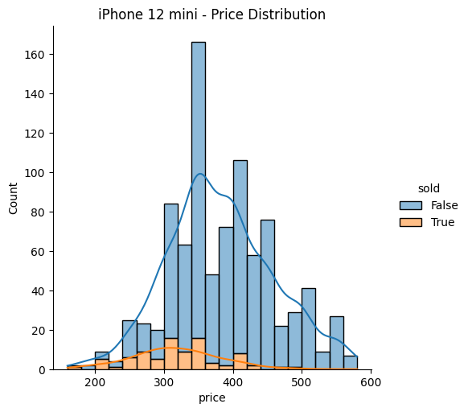

# Dubito

Dubito is a Python package that allows you to track Subito insertions. It's a simple tool that allows you to track subito insertions by specifying a query and some filters. It's useful if you want to track a specific product or if you want to track a product in a specific region or any product for a specific query.

This project was inspired by the [subito-it-searcher](https://github.com/morrolinux/subito-it-searcher) project, and its aim is to introduce notable improvements.

## Installation

To install the package you can use pip:

`pip install dubito`

## Example usage of the CLI

Running the command:

`dubito --help`

The result will be:

```bash
usage: dubito [-h] {query} ...

Get Subito insertions from a query or a url.

positional arguments:
  {query}     sub-command help
    query     Get Subito insertions from a query or a url.

options:
  -h, --help  show this help message and exit

Enjoy the program! :)
```

Running the **query** command:

`dubito query --help`

```bash
usage: dubito query [-h] (-q QUERY | --url URL) [-i INCLUDE [INCLUDE ...]] [-e EXCLUDE [EXCLUDE ...]] [--minimum-price MINIMUM_PRICE]
                    [--maximum-price MAXIMUM_PRICE] [--install-cache] [-v] [--remove-outliers]

options:
  -h, --help            show this help message and exit
  -q QUERY, --query QUERY
                        The query to search.
  --url URL             The url to search.
  -i INCLUDE [INCLUDE ...], --include INCLUDE [INCLUDE ...]
                        Exclude keywords from the query to search.
  -e EXCLUDE [EXCLUDE ...], --exclude EXCLUDE [EXCLUDE ...]
                        Include keywords from the query to search.
  --minimum-price MINIMUM_PRICE
                        The minimum price.
  --maximum-price MAXIMUM_PRICE
                        The maximum price.
  --install-cache       Install the cache.
  -v, --verbose         Verbose.
  --remove-outliers     Remove outliers.
```

---

# Data visualization

The execution of the **query** command will produce a folder named *results* which contains the report for the executed query.



the visualization of the price distribution facilitates the identification of the best selling and purchasing price for a specific good.

---

This will download and transform the first page of the query `gtx 1070` and save the data.

`dubito query -q "gtx 1070" --install-cache  -i 1070 -e pc i7 ryzen --minimum-price 90 --remove-outliers`

## Iterate over the items of every list page of a query

If you want to iterate over the items of every list page of a query you can use the `subito_list_page_item_iterator` function. This function takes a `SubitoListPage` object as input and returns a generator that yields the items of every list page of the query. The iterator will stop when finds a page with no items.

```python
from dubito.subito_list_page import subito_list_page_item_iterator, SubitoListPageQuery

for item in subito_list_page_item_iterator(SubitoListPageQuery("nintendo switch")):
    print(item["title"], item["price"])
```

## Iterate over list pages

The iterator will stop when finds a page with no items.

```python
from dubito.subito_list_page import SubitoListPage

for list_page in SubitoListPage("https://www.subito.it/annunci-italia/vendita/usato/?q=nintendo%20switch").extract():
    print(len(list_page.subito_list_page_items), list_page.page_number)
```

# Get a dataframe of list page items

```python
import pandas as pd

subito_list_page_items = subito_list_page_item_iterator(SubitoListPageQuery(query))
subito_list_page_items = list(subito_list_page_items)
subito_list_page_items = pd.DataFrame(subito_list_page_items).set_index("identifier")
```

# Run tests

To run the tests you can use the following command:

`python -m unittest`

# Very nice, but...

Unfortunately, the use of this tool is not recommended, in fact, on the general conditions of the service page of Subito.it, in section 5, it is explicitly mentioned that:

- **IT**: <cite>
L'utente, inoltre, si assume ogni responsabilità per eventuali danni che possano derivare al suo sistema informatico dall'uso del Servizio o a quello di terzi. Resta infine inteso che ogni eventuale utilizzo di robot, spider, scraper e/o ulteriori  strumenti automatici per accedere al sito e/o per estrapolare i relativi dati, contenuti, informazioni è espressamente vietato.
</cite>

- **EN**: <cite>
Furthermore, the user assumes all responsibility for any damage that may arise to his computer system from the use of the Service or to that of third parties. Finally, it is understood that any use of robots, spiders, scrapers and/or other automatic tools to access the site and/or to extrapolate the related data, contents, information is expressly prohibited.
</cite>